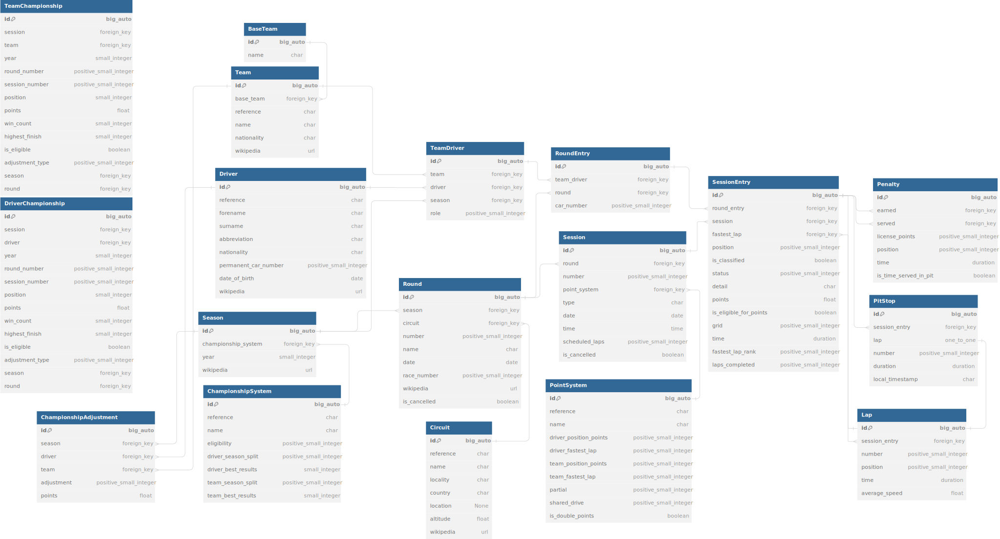

# jolpica-f1
API for querying formula one data, with backwards compatible endpoints for the soon to be deprecated ergast api.

The Ergast compatible API can be found here: http://api.jolpi.ca/ergast/f1/

# Documentation
Our documentation can be [found here](/docs/README.md).

### Ergast Differences
If you are migrating from the ergast api, please check the known differences [here](/docs/ergast_differences.md).


# Database Scheme
Rather than import the existing database scheme used by ergast, we use a new scheme which will allow better adaption to changing rulesets, reduce duplication of information, and allow storage of more F1 related data.

Many Enumerations are used in the database, the mappings of these values are defined in their respective model files. For example you can find the enumerations for the PointSystem table [here](jolpica/formula_one/models/point_scheme.py)

# Development
## Initial Setup
### Prerequisite
Use of the devcontainer is recommended. If not using, look at `.devcontainer/Dockerfile` for required installs.<br>
Current requirements are:
- Poetry for python
- [Geo Libraries for postgis and geodjango](https://docs.djangoproject.com/en/4.2/ref/contrib/gis/install/geolibs/#geosbuild)
- A postgres database which can be accessed via the `DATABASE_SECRET_URL` environment variable.

### Data Import
- If not using the devcontainer, Install python dependencies `poetry install`, and activate the venv `poetry shell`
- Create all required database tables
  ```
  python manage.py migrate
  ```
- Download csv data from ergast and import into postgres database
  ```
  make load-ergast-data
  ```
- Convert data to new schema, then run & create the test database
  ```
  make import-from-ergast
  pytest --create-db
  ```
This will fill the database with the latest data from ergast, and create the initial test database so all future tests will run quicker.

## Running the Server

To run the server

```python manage.py runserver 0.0.0.0:8000```

This will start jolpica-f1 on port 8000. Once it is running you can access the API via browser, curl or any other tools with `http://localhost:8000/ergast/f1/`. Any changes made to the source code will be automatically updated, while it is running.

## Running Tests
The first time the tests are run it will take upto 2 minutes to populate the database with test data, pytest is configured to reuse this database on future runs, so tests should run much faster on future runs.<br>
To run tests after a migration change you must run with the `--create-db` flag to ensure it uses the new migrations.<br>

To run the tests
```pytest```

## Reporting Bugs / Contributing

For information on contributing to this project please read the [contributing guidelines](CONTRIBUTING.md).
