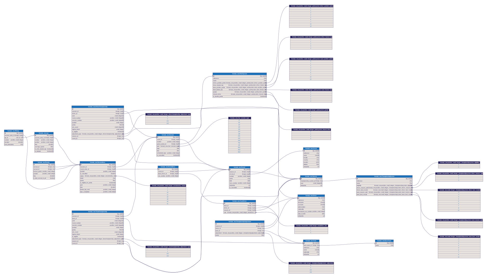

# jolpica-f1
Jolpica F1 is an open source API for querying Formula 1 data, with backwards compatible endpoints for the soon to be deprecated Ergast API.

Jolpica F1 is maintained by a small group of volunteers. Our hosting costs are around $45 USD per month. If you want to support the project's ongoing development and improvements, please consider [donating to our Kofi]([url](https://ko-fi.com/jolpicaf1)). Our fundraising goal is to be break-even by the start of the 2025 season.

The Ergast compatible API can be found here: http://api.jolpi.ca/ergast/f1/

By using the jolpica-f1 API, you agree to our [Terms of Use](TERMS.md).

# Documentation
Our documentation can be [found here](/docs/README.md).

### Ergast Differences
If you are migrating from the Ergast API, please check the known differences [here](/docs/ergast_differences.md).

# Database Scheme
Our database model is not yet finalised and is different to the one used by ergast, this scheme will allow better adaption to changing rulesets, reduce duplication of information, and allow storage of more F1 related data.

Check out our database docs [here](https://dbdocs.io/jolpica/jolpica-f1?view=relationships). 

Many Enumerations are used in the database, the mappings of these values are defined in their respective model files. For example you can find the enumerations for the PointSystem table [here](jolpica/formula_one/models/point_scheme.py)

Database dumps can be dowloaded via the API. This is documented [here](/docs/database_dumps.md)

## Reporting Bugs / Contributing

For information on contributing to this project please read the [contributing guidelines](CONTRIBUTING.md).
You can also find instructions to run the project locally in [CONTRIBUTING.md](CONTRIBUTING.md).

# Community Projects

Below is a list of some open source community projects that use the jolpica-f1 API. If you've created something you'd like to share feel free to open a pull request to add it to the list.

### SDKs
- [FastF1](https://github.com/theOehrly/Fast-F1) - Python package for accessing and analyzing Formula 1 results, schedules, timing data and telemetry.
- [f1dataR](https://github.com/SCasanova/f1dataR)-  R package to access Formula 1 Data from the jolpica-f1 API.
- [JolpicaKit](https://github.com/fantasia-y/JolpicaKit) - Swift wrapper for the jolpica-f1 API.

### Applications and Integrations
- [FormulaOne Card](https://github.com/marcokreeft87/formulaone-card) - Home Assistant Card showing Formula One Data.
- [tap-f1](https://github.com/ReubenFrankel/tap-f1)-  A Singer tap for F1.
- [Next F1 Race scriptable widget](https://github.com/timespacedecay/scriptable) - Widget for scriptable to display the next F1 Race.
- [FormulaVision](https://github.com/skat9234/formula-vision) - A Mobile F1 Dashboard built with Flutter.
- [RaceTimeApp](https://www.github.com/MayckGomes/RaceTimeApp) - An Android App showing latest F1 data, Built with Jetpack Compose.
- [OversteerFormula1App](https://github.com/HugoLe-SS/OversteerFormula1App) - OversteerFormula1App is an Android project built with Kotlin and Jetpack Compose, designed to provide race schedules, standings, race results, news, and live updates.
- [F1 Points Calculator](https://github.com/yuyangchee98/F1-Points-Calculator) - An interactive championship points calculator and race simulator for predicting F1 standings. Results update every week using jolpica-f1 data. 
